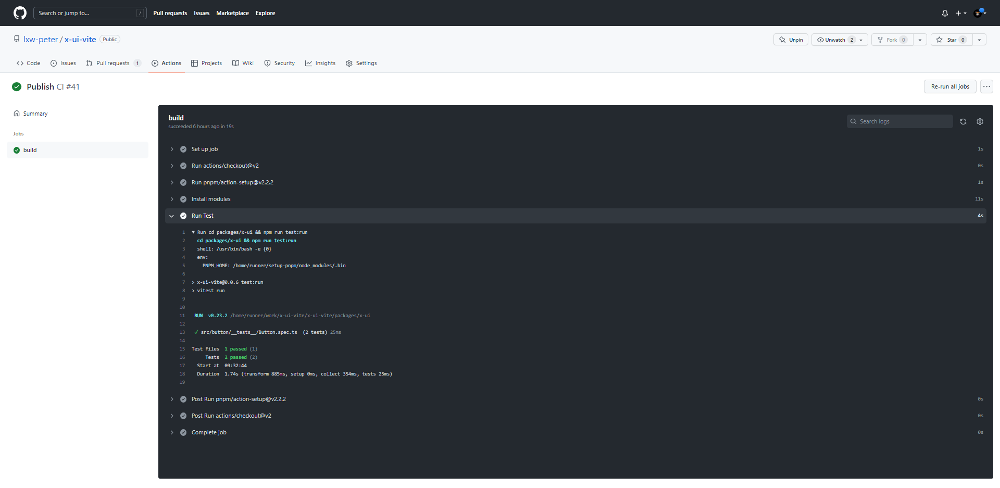
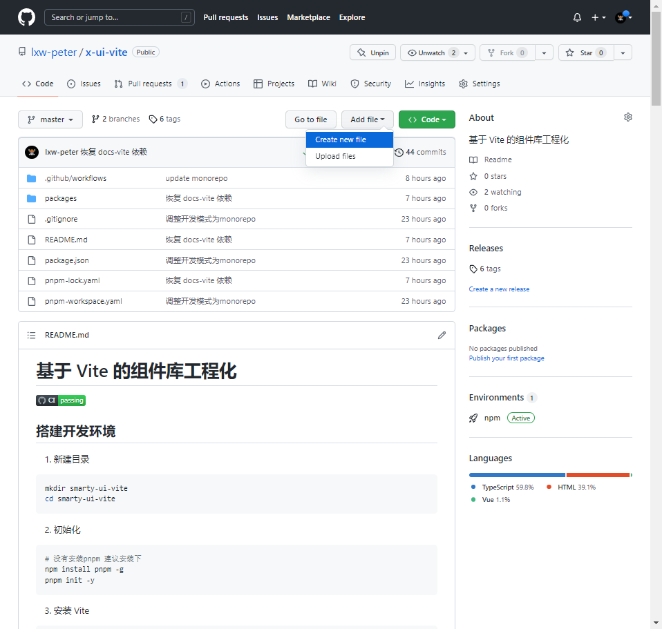
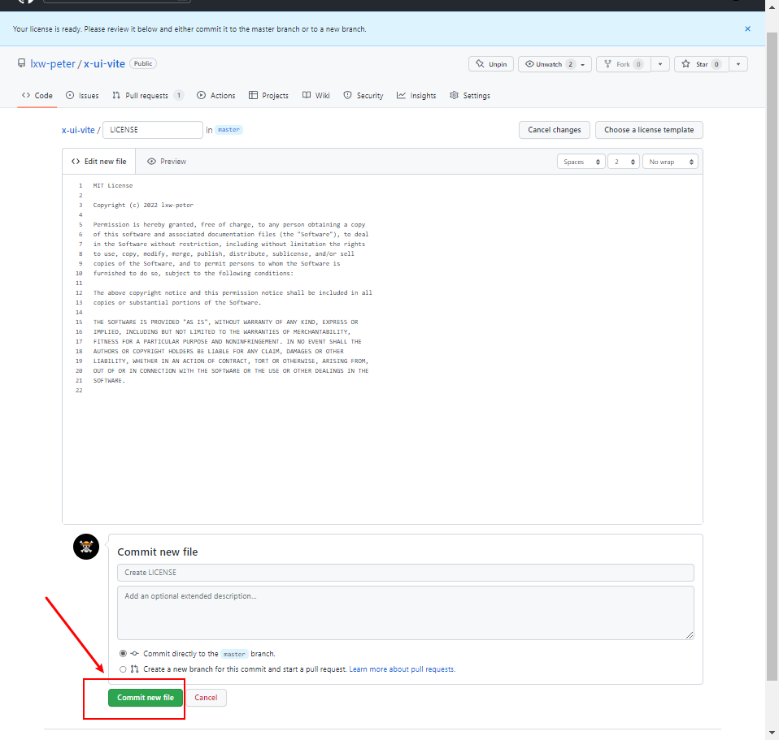

# 基于 Vite 的组件库工程化

<p align="center">
<a href="https://github.com/lxw-peter/smarty-ui-vite/actions/workflows/main.yml"></a>
</p>

## 搭建开发环境

1. 新建目录

```sh
mkdir smarty-ui-vite
cd smarty-ui-vite
```

2. 初始化

```sh
# 没有安装pnpm 建议安装下
npm install pnpm -g
pnpm init -y
```

3. 安装 Vite

```sh
pnpm i vite -D
```

4. 创建测试文件

```html
<!-- index.html -->
<!DOCTYPE html>
<html lang="en">
  <head>
    <meta charset="UTF-8" />
    <title>Smarty UI</title>
  </head>

  <body>
    <div id="app">smarty ui</div>
    <script type="module" src="./src/index.ts"></script>
  </body>
</html>
```

```ts
// ./src/index.ts
const arr: number[] = [1, 2, 3];
```

5. 启动项目

```sh
# 使用 npx 执行软件包中的可执行文件
# 相当于执行 node_modules/.bin
npx vite
```

为了方便后续操作，可以再 `package.json` 中添加启动脚本，然后可以使用 `pnpm dev` 启动

```json
{
  "script": {
    "dev": "vite"
  }
}
```

## 组件库搭建

### 让 `Vite` 支持 `SFC` 和 `JSX` 语法，并支持 `tsx` 文件导入

1. 安装插件

```sh
# 前者支持 SFC 语法， 后者用以 JSX 语法
pnpm install @vitejs/plugin-vue @vitejs/plugin-vue-jsx -D
```

2. 创建 vite.config.ts

```ts
// vite.config.ts
import { defineConfig } from 'vite';
import vue from '@vitejs/plugin-vue';
import vueJsx from '@vitejs/plugin-vue-jsx';

export default defineConfig({
  plugins: [vue(), vueJsx()],
});
```

3. 创建类型声明文件

```ts
// src/shims-vue.d.ts
declare module '*.vue' {
  import { DefineComponent } from 'vue';
  const component: DefineComponent<{}, {}, any>;
  export default component;
}
```

4. 创建 tsconfig.json

```json
{
  "compilerOptions": {
    "declaration": true /* 生成相关的 '.d.ts' 文件。 */,
    "declarationDir": "./dist/types" /* '.d.ts' 文件输出目录 */,
    "jsx": "preserve"
  },
  "include": ["./**/*.*", "./shims-vue.d.ts"],
  "exclude": ["node_modules"],
  "esModuleInterop": true,
  "allowSyntheticDefaultImports": "true"
}
```

### 组件库的封装形式

- 按需引入
- 全量引入

```ts
// src/entry.ts
import { App } from 'vue';
import MyButton from './button';
import SFCButton from './SFCButton.vue';
import JSXButton from './JSXButton';

// 导出单独组件

export { MyButton, SFCButton, JSXButton };

export default {
  install(app: App): void {
    app.component(MyButton.name, MyButton);
    app.component(SFCButton.name, SFCButton);
    app.component(JSXButton.name, JSXButton);
  },
};
```

```ts
// 单独引入
import { createApp } from 'vue/dist/vue.esm-bundler.js';
import { SFCButton, JSXButton, MyButton } from '../../dist/smarty-ui.esm.js';

createApp({ emplate: `<SButton/><JSXButton/><SFCButton/>` })
  .component(SFCButton.name, SFCButton)
  .component(JSXButton.name, JSXButton)
  .component(MyButton.name, MyButton)
  .mount('#app');
```

```ts
import { createApp } from 'vue/dist/vue.esm-bundler.js';
import SmartyUI from '../../dist/smarty-ui.esm.js';
// 全量引入
createApp({ template: `<SButton/><JSXButton/><SFCButton/>` }).use(SmartyUI).mount('#app');
```

### 使用 `Vite` 构建库文件

```ts
// vite.config.ts
const rollupOptions = {
  external: ['vue', 'vue-router'],
  output: {
    globals: {
      vue: 'Vue',
    },
  },
};
export default defineConfig({
  plugins: [vue(), vueJsx()],
  build: {
    rollupOptions,
    minify: false,
    lib: {
      entry: './src/entry.ts',
      name: 'SmartyUI',
      fileName: 'smarty-ui',
      formats: ['esm', 'umd', 'iife'],
    },
  },
});
```

## CSS 样式 - 用 Unocss 实现原子化 CSS

`Taiwind` 和 `Unocss` 都可以实现原子样式，为什么采用 `Unocss` ?

- 性能更好，更强的可定制型和易用性
- 无需解析、无需 AST、无需扫描，即时生成
- 对 Vite 的支持性更好

### 安装

```sh
# @iconify-json/ic 图标库可自行选用
pnpm i -D unocss @iconify-json/ic
```

### 配置

```ts
// config/unocss
import { presetUno, presetAttributify, presetIcons } from 'unocss';
import Unocss from 'unocss/vite';
// 配置 safelist, UnoCSS 默认是按需生成方式， 需要定制安全列表才会根据 safelist 生成样式
const safelist = [...colors.map((v) => `bg-${v}-100`)];
export default () =>
  Unocss({
    safelist,
    presets: [presetUno(), presetAttributify(), presetIcons()],
  });

// vite.config.ts
import Unocss from './config/unocss';
defineConfig({
  plugins: [vue(), vueJsx(), Unocss()],
  // ...
});
```

### 使用

```tsx
import 'uno.css';

export default defineComponent({
  name: 'SButton',
  props,
  setup(props, { slots }) {
    return <button class="bg-color-500 cursor-pointer"></button>
  })
```

## VitePress 生成组件文档

### 安装插件

```sh
# 这里没有使用vitepress@1.0RC版本是因为 vitepress-theme-demoblock 插件还未适配
pnpm i vitepress@0.22.4 vitepress-theme-demoblock@1.4.2 -D
pnpm i @types/node -D
```

### 文件目录示例

```
├─index.md                 // 自定义内容
├─vite.config.ts           // 配置vite
├─components
|     ├─button
|     |   └index.md        // 自定义内容
├─.vitepress
|     ├─config.ts          // vitepress 配置
|     ├─theme
|     |   └index.ts        // 主题配置

```

### vite.config.ts

```ts
import { defineConfig } from 'vite';
import vueJsx from '@vitejs/plugin-vue-jsx';
import Unocss from '../config/unocss';

export default defineConfig({
  plugins: [vueJsx(), Unocss()],
});
```

### .vitepress/config.ts

```ts
// 配置侧边栏
const sidebar = {
  '/': [
    { text: '快速开始', link: '/' },
    {
      text: '通用',
      children: [{ text: 'Button 按钮', link: '/components/button/' }],
    },
  ],
};
const config = {
  title: 'VitePress',
  description: 'Just playing around.',
  themeConfig: {
    sidebar,
  },
  markdown: {
    config: (md) => {
      const { demoBlockPlugin } = require('vitepress-theme-demoblock');
      md.use(demoBlockPlugin);
    },
  },
};
export default config;
```

### .vitepress/theme/index.ts

```ts
import DefaultTheme from 'vitepress/theme';
import SmartyUI from '../../../src/entry';
// 主题样式
import 'vitepress-theme-demoblock/theme/styles/index.css';
// 插件的组件，主要是demo组件
import Demo from 'vitepress-theme-demoblock/components/Demo.vue';
import DemoBlock from 'vitepress-theme-demoblock/components/DemoBlock.vue';

export default {
  ...DefaultTheme,
  enhanceApp({ app }) {
    app.use(SmartyUI);
    app.component('Demo', Demo);
    app.component('DemoBlock', DemoBlock);
  },
};
```

## 软件包封装

### 模块规范

- ESM：ES 标准的模块化方案
- IIFE：立即执行函数
- CJS：基于　 CommonJS 标准的模块化

```ts
import { resolve } from 'path';
export default defineConfig({
  build: {
    // 库模式
    lib: {
      entry: resolve(__dirname, 'src/entry.ts'),,
      name: 'XUI', // 暴露的全局变量
      formates: ['es', 'esm', 'umd', 'iife'], // 这里的 `esm`选项会输出内容和 `es` 一致的文件，文件名以`esm.js`结尾；不在支持的格式内，但可以生效
      filename: 'x-ui', // 默认为 `package.json`的 `name` 选项，还可以是 `format` 函数
    }
    // 指定 lib 后，build.cssCodeSplit 默认为 false
  }
})
```

### 压缩混淆

```ts
// vite.config.ts
export default defineConfig({
  build: {
    minify: 'terser', // boolean | 'terser' | 'esbuild'
  },
});
```

```sh
// vite@3.0 版本 当`minify`为`terser`时，需要先安装Terser
pnpm i -D terser
```

### SourceMap

```ts
// vite.config.ts
export default defineConfig({
  build: {
    sourcemap: 'false', // boolean | 'inline' | 'hidden'
  },
});
```

## GitHub Action

> [详细文档参考](https://docs.github.com/cn/actions/quickstart)

### 目标

上传到 GitHub 后开始自动化单元测试任务

### 任务分解

1. 根目录下创建 `.github/workflows` 工作目录

2. 新建 `main.yml` 文件

步骤：

- 设置任务名称：`CI`
- 触发机制：`push | pull_request`
- 触发分支：`master`
- 选择系统：`ubuntu-latest`
- 运行环境: `npm`
- 设置步骤
  - 初始化运行环境
  - CD 到对应目录
  - 安装依赖
  - 执行测试

内容：

```yaml
# 设置任务名称：CI
name: CI
# 触发机制：push | pull_request
# 触发分支：master
on:
  push:
    branches: ['master']
  pull_request:
    branches: ['master']
  workflow_dispatch:
jobs:
  build:
    # 选择系统
    runs-on: ubuntu-latest
    steps:
      # 初始化运行环境
      - uses: actions/checkout@v2
      - uses: pnpm/action-setup@v2.2.2
        with:
          version: 7.11.0
      - name: Install modules
        # 安装依赖， --no-frozen-lockfile 设置不依赖 pnpm-lock.yaml 锁定版本，存在新版本自动升级;--frozen-lockfile 设置锁定版本
        run: pnpm install --no-frozen-lockfile
      - name: Run Test
        run: cd packages/x-ui && npm run test:run
```

3. 提交代码

4. 查看 actions 运行效果



## 创建 License

1. 新建文件



2. 输入 `LICENSE` 自动识别


3. 选择 `license template`


4. 提交

  

## 发布到 NPM

## 使用 GitHub Actions 自动发布

## 使用 Monorepo 的构建方式管理组件库

- 安装全局npm包

```sh
pnpm install vue -w
```
- 子包安装单独 npm 包

```sh
# 在根目录下执行如下命令，表示在 @package/a 包中单独安装 vue
pnpm install vue -r --filter @package/a 
```

- 子包安装其它 package 模块

```sh
# 在根目录下执行如下命令，表示在 @package/b 包中安装 @package/b 
pnpm install @package/a -r --filter @package/b 
```

安装成功后 `package.json` 的依赖中会显示 workspace 字段，如下所示

```json
 {
  "dependencies": {
    "@types/node": "^18.7.15",
    "vue": "^3.2.39",
    "x-ui-vite": "workspace:^0.0.6"
  }
 }
 ```

## 实现组件库按需引入

## 文档部署

## README 规范

- 标题
- banner
- 特性、用途
- 徽章：npm 下载量、测试覆盖率、通过 CI 工具持续验证
  - [徽章制作查询](https://shields.io/)
- Contributing 贡献者名单
- 开源许可证
